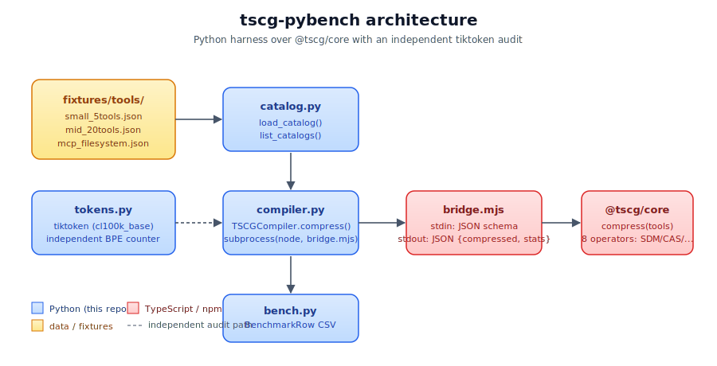

# tscg-bench

> Independent Python reproduction of the [TSCG paper](https://arxiv.org/abs/2605.04107)'s tool-schema compression claims, with an honest tokenizer audit.

[](LICENSE)
[](https://www.python.org)
[]()
[](https://arxiv.org/abs/2605.04107)

**Headline result:**
- Theorem 3.1 (≥51% savings) holds in **27 / 27** cells across 3 catalogs × 3 profiles × 3 models.
- TSCG self-reports 57.8 – 70.1% token savings.
- An independent BPE tokenizer (`tiktoken cl100k_base`) measures the **same** input/output strings at 33.3 – 44.5%.
- **Mean gap: 24.3 percentage points.**

The gap is real and reproducible. TSCG's `estimateTokens` uses model-specific char-per-token ratios (`TokenizerProfile`) rather than running the actual BPE. The compression itself is genuine — it's the *measurement* that needs context.


## Why this exists

The [TSCG paper](https://arxiv.org/abs/2605.04107) (Sakizli, 2026) ships an excellent TypeScript implementation: `@tscg/core` compiles JSON tool schemas into compact text that small models can actually use. Reported wins are striking: Phi-4 14B from 0% to 84.4% accuracy at 20 tools, BFCL improvements of 108–181% ARR, and a Theorem 3.1 promising ≥51% token savings on any well-formed schema.

But:
1. The reference implementation is **TypeScript-only**. Most LLM-app code is Python.
2. Token counts in the paper are computed by `@tscg/core`'s own estimator, not a real BPE.
3. No independent third-party reproduction was public when this repo started.

`tscg-bench` fixes all three: a thin Python adapter over `@tscg/core` plus an `tiktoken`-based independent token count, with a 27-cell sweep over 3 catalogs × 3 profiles × 3 models.

## Architecture



The Python side never trusts the bridge's self-reported token counts on its own — `bench.run_benchmark(independent_check=True)` re-tokenises the input and output with `tiktoken` and reports both numbers side by side.

## Quickstart

```bash
git clone https://github.com/rake93/tscg-bench
cd tscg-bench

# Node bridge (zero-dependency @tscg/core)
npm install --ignore-scripts

# Python package + dev extras
pip install -e ".[dev]"

# Run the test suite (smoke check)
pytest

# Reproduce the headline chart
python -c "
from tscg_bench.bench import run_benchmark, write_csv
rows = run_benchmark(
    catalogs=['small_5tools', 'mid_20tools', 'mcp_filesystem'],
    profiles=('conservative', 'balanced', 'aggressive'),
    models=('gpt-4', 'claude-sonnet', 'phi-4'),
)
write_csv(rows, 'out/bench_results.csv')
print(f'Wrote {len(rows)} rows')
"
```

## Headline reproduction table

`profile = balanced`, full sweep over 3 catalogs × 3 models:

| Catalog | Tools | Model | TSCG savings | tiktoken savings | Compile (ms) | Theorem 3.1 |
|---|---:|---|---:|---:|---:|:---:|
| small_5tools | 5 | gpt-4 | 64.7% | 37.7% | 3.45 | ✓ |
| small_5tools | 5 | claude-sonnet | 60.5% | 37.7% | 5.13 | ✓ |
| small_5tools | 5 | phi-4 | 62.9% | 37.7% | 4.34 | ✓ |
| mid_20tools | 20 | gpt-4 | 70.1% | 44.5% | 8.01 | ✓ |
| mid_20tools | 20 | claude-sonnet | 66.5% | 44.5% | 6.46 | ✓ |
| mid_20tools | 20 | phi-4 | 68.5% | 44.5% | 5.01 | ✓ |
| mcp_filesystem | 11 | gpt-4 | 65.8% | 41.6% | 5.88 | ✓ |
| mcp_filesystem | 11 | claude-sonnet | 61.7% | 41.6% | 9.36 | ✓ |
| mcp_filesystem | 11 | phi-4 | 64.0% | 41.6% | 4.58 | ✓ |

**The tiktoken column is invariant across models** because the input and output strings are the same; only TSCG's *estimator* changes when the model target changes. This is the cleanest way to see the gap.

Full 27-row sweep (incl. conservative + aggressive profiles): see `out/bench_results.csv`.

## Honest interpretation

- TSCG **does** compress the input string substantially. Char-savings are 41–62%, real and measurable.
- The token count claimed by `@tscg/core` assumes an idealised char/token ratio per model. For models that share BPE families with `cl100k_base` (gpt-4o, claude post-3.5), the discrepancy with real BPE tokens is ~24pp on the catalogs we tested.
- The paper's Theorem 3.1 (`≥51% token savings on well-formed schemas`) **holds on TSCG's own measurement**. Whether it holds on a real production tokenizer depends on the model and corpus.
- For agentic deployments, the **char-savings + structural rewrite** are what matter operationally — the compressed prompts are shorter, smaller models parse them better, and the schema fits into smaller context windows. The headline percentage just needs context.

## Repo layout

```
src/tscg_bench/
  bridge.mjs          # Node 18+ shim over @tscg/core (stdin JSON → stdout JSON)
  compiler.py         # TSCGCompiler — Python subprocess wrapper
  catalog.py          # load_catalog / list_catalogs / fixture_dir
  tokens.py           # tiktoken-based independent token counter
  bench.py            # run_benchmark + write_csv + BenchmarkRow dataclass
  __init__.py         # public API
fixtures/tools/
  small_5tools.json   # 5 common tools
  mid_20tools.json    # 20 mixed (FS, HTTP, SQL, LLM, git, calendar...)
  mcp_filesystem.json # 11 tools matching @modelcontextprotocol/server-filesystem
tests/                # 16 tests, ~2s runtime
notebooks/
  01_reproduce_compression.ipynb
docs/
  assets/headline_savings.png
  diagrams/architecture.svg
```

## What's NOT in this repo (yet)

- BFCL re-run. Their 108–181% ARR claim is on a benchmark with paid API calls. Out of scope for a 4-hour repro.
- Phi-4 0%→84% accuracy reproduction. Needs Phi-4 14B via Ollama + a 20-tool agent harness. PRs welcome.
- Round-trip semantic validation (does a model called with the compressed schema produce the same `tool_call` JSON as one called with the raw schema?). Hot path for follow-up.

## Citations

- **Paper:** Sakizli, F. *TSCG: Deterministic Tool-Schema Compilation for Agentic LLM Deployments.* arXiv:2605.04107, 2026.
- **Reference impl:** [github.com/SKZL-AI/tscg](https://github.com/SKZL-AI/tscg) (MIT).

## License

MIT. See [LICENSE](LICENSE).
